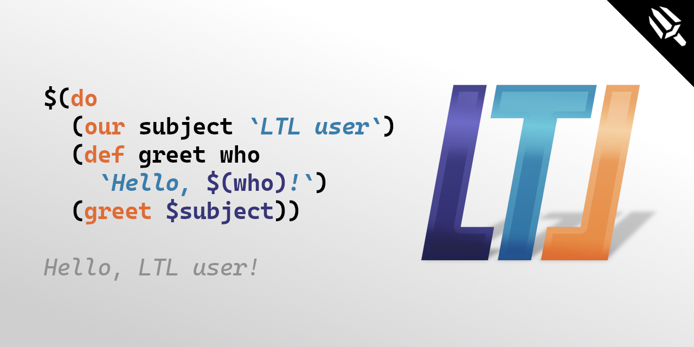

<a name="readme-top"></a>
<div align="center">
	<a href="./LICENSE">
		
	</a>
	<a href="https://github.com/LordOfTrident/ltl/graphs/contributors">
		
	</a>
	<a href="https://github.com/LordOfTrident/ltl/stargazers">
		
	</a>
	<a href="https://github.com/LordOfTrident/ltl/issues">
		
	</a>
	<a href="https://github.com/LordOfTrident/ltl/pulls">
		
	</a>
	<br><br><br>
	
	<p align="center">Lisp-like Template Language</p>
	<p align="center">
		<a href="#documentation">Documentation</a>
		·
		<a href="https://github.com/LordOfTrident/ltl/issues">Report Bug</a>
		·
		<a href="https://github.com/LordOfTrident/ltl/issues">Request Feature</a>
	</p>
	<br>
	
	<br>
	<br>
</div>

<details>
	<summary>Table of contents</summary>
	<ul>
		<li><a href="#introduction">Introduction</a></li>
		<li><a href="#demo">Demo</a></li>
		<li><a href="#quickstart">Quickstart</a></li>
		<li><a href="#bugs">Bugs</a></li>
	</ul>
</details>

## Introduction
**LTL** is a [Lisp-like](https://en.wikipedia.org/wiki/Lisp_(programming_language)) language written
in [Nim](https://nim-lang.org/) for templating and text automation. Example usage is a static
[HTML](https://en.wikipedia.org/wiki/HTML) site, where you can use LTL to reuse a header across
multiple pages.

## Example
Example file `examples/count-to-10.ltl`:
```
I'm gonna count from 1 to 10:
$(join `\n` (for n 1 10 1 `Counting: $(int $n)`))
Finished!
```
Now, if we run the file, we get the following output:
```
$ ltl -f examples/count-to-10.ltl
I'm gonna count from 1 to 10:
Counting: 1
Counting: 2
Counting: 3
Counting: 4
Counting: 5
Counting: 6
Counting: 7
Counting: 8
Counting: 9
Counting: 10
Finished!
```

See more examples in the [examples folder](./examples).

## Quickstart
```
$ git clone https://github.com/LordOfTrident/ltl
$ cd ltl
$ nimble build
$ ./ltl -h
```

## Documentation
Coming soon.

## Bugs
If you find any bugs, please, [create an issue and report them](https://github.com/LordOfTrident/ltl/issues).

<br>
<h1></h1>
<br>

<div align="center">
	<a href="https://nim-lang.org/">
		
	</a>
	<p align="center">Made with ❤️ love</p>
</div>

<p align="right">(<a href="#readme-top">Back to top</a>)</p>
